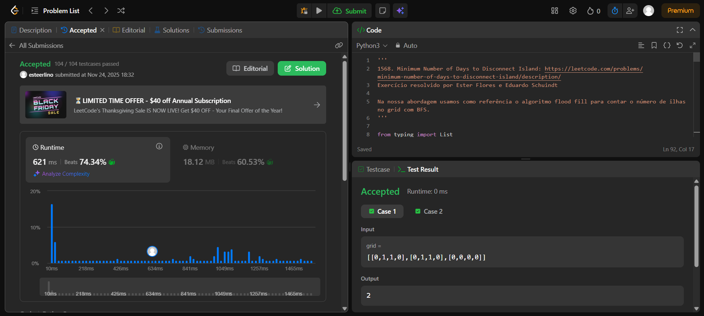
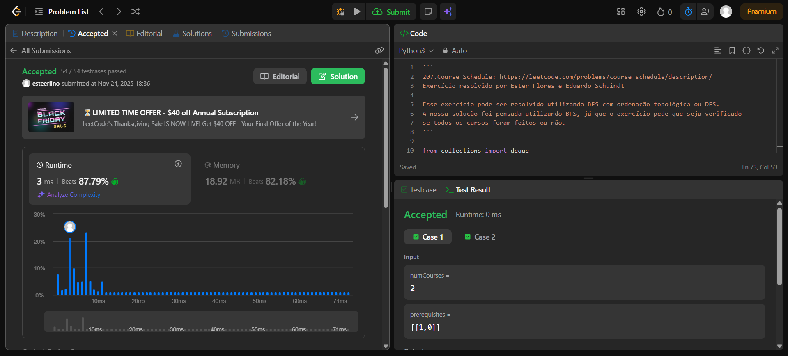
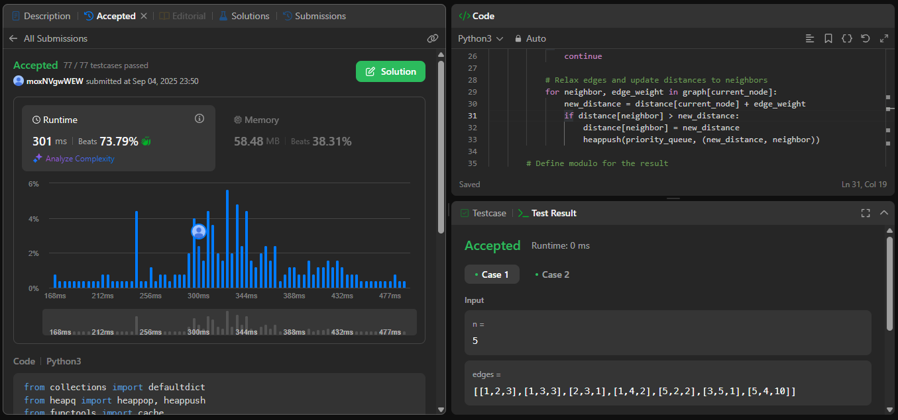
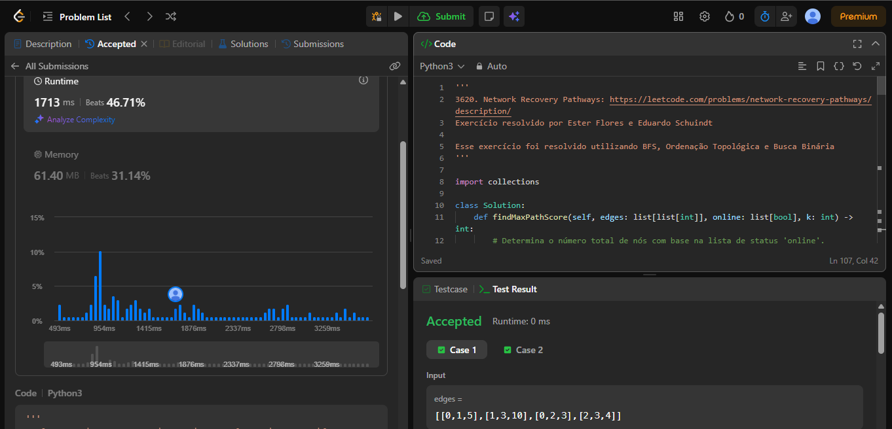

# Trabalho 4 - Grafos

## Alunos  
| Matrícula | Nome |  
|-----------|---------------------|  
| 20/2063201 | Ester Flores Lino da Silva |  
| 20/2042927 | Eduardo Schuindt Santos |

## Descrição do projeto

Para o Trabalho 4 a dupla optou por solucionar questões da plataforma **[LeetCode](https://leetcode.com/)**. Seguindo as orientações do professor Maurício Serrano, resolvemos 4 desafios. Dois do nível difícil e dois do nível médio. Dessa maneira, a dupla busca demonstrar o conhecimento adquirido durante as aulas e estudos sobre o tema Grafos.

Sobre a realização do trabalho, cada exercício contém seu código resposta, screenshots da tela de submissão do **[LeetCode](https://leetcode.com/)** e vídeo de até 5 minutos explicando objetivamente as resoluções propostas.

## Guia de instalação

Alguns exercícios foram resolvidos em Python e outros em Java.

## Capturas de tela

### Exercício 01 - Difícil - 1568. Minimum Number of Days to Disconnect Island

### Exercício 02 - Difícil - 207. Course Schedul

### Exercício 03 - Médio - 1786. Number of Restricted Paths From First to Last Node

### Exercício 04 - Médio - 3620. Network Recovery Pathways

## Vídeo de apresentação do Trabalho 4

[Link da apresentação do Trabalho 4](https://youtu.be/tu-aAsUXyH4)

## Verificação

Para verificar se as resoluções aqui propostas estão corretas e foram aceitas, submeter os códigos no **[LeetCode](https://leetcode.com/)** e conferir se foi aceito ou não. Todo exercício contém o link para descrição do problema no seu próprio código de resolução.
